# Enterprise Media Processing Pipeline

A production-grade, highly optimized media ingestion and processing pipeline. Built with Go 1.26, Gin, NATS JetStream, PostgreSQL (via sqlc), MinIO (S3 API), and FFmpeg.

Features a premium real-time HTML5 client dashboard supporting adaptive concurrent chunked uploads, session resumption across reloads/cancellations, background media transcoding/processing workers, and automatic storage cleanup.

---

## System Architecture & Flow

```mermaid
sequenceDiagram
    autonumber
    actor User as Web Client
    participant API as Go API Service
    participant S3 as MinIO (S3 Bucket)
    participant NATS as NATS JetStream
    participant Worker as Background Workers
    participant DB as PostgreSQL

    User->>API: 1. POST /uploads (Initialize)
    API-->>User: Presigned URLs for chunks
    rect rgb(30, 41, 59)
        note right of User: Parallel Concurrent Uploads (6 Workers)
        User->>S3: 2. PUT /uploads/{id}/chunks/{i} (Direct Upload)
        User->>API: 3. POST /uploads/{id}/chunks/{i} (Register Chunk)
    end
    User->>API: 4. POST /uploads/{id}/chunks/{id}/complete
    API->>S3: Compose multipart chunks into final source object
    API->>DB: Record upload status and start processing job
    API->>NATS: Publish "pipeline.upload.completed"
    API-->>User: Return success & Job ID
    
    par Processing Tasks
        NATS->>Worker: Consume pipeline.upload.completed (Metadata Job)
        Worker->>S3: Fetch source file
        Worker->>Worker: Run ffprobe (Extract metadata)
        Worker->>DB: Save metadata, update job status
        Worker->>NATS: Publish "pipeline.metadata.extracted"
    and
        NATS->>Worker: Consume pipeline.metadata.extracted (Thumbnail Job)
        Worker->>S3: Fetch source, generate png thumbnail via ffmpeg
        Worker->>S3: Save thumbnail in S3
        Worker->>DB: Update job status
        Worker->>NATS: Publish "pipeline.thumbnail.generated"
    and
        NATS->>Worker: Consume pipeline.metadata.extracted (Transcode Job)
        Worker->>S3: Fetch source, transcode 5s preview webm/mp4 via ffmpeg
        Worker->>S3: Save transcoded preview in S3
        Worker->>DB: Update job status
        Worker->>NATS: Publish "pipeline.transcode.completed"
    and
        NATS->>Worker: Consume pipeline.upload.completed / canceled (Cleanup Job)
        Worker->>S3: Purge temporary upload chunks
        note over Worker: If canceled, purges entire upload directory
    end

    User->>API: 5. Poll GET /jobs/upload/{id}
    API-->>User: Return current processing state
    User->>User: Render Live Progress & Media Showcase (Video/Image)
```



---

## Project Structure

```
├── cmd/
│   ├── api/                  # Main Go REST API entrypoint
│   └── worker/               # Background orchestration workers entrypoint
├── configs/                  # Service configuration files
├── db/
│   ├── migrations/           # Database migration files (PostgreSQL)
│   ├── queries/              # Raw SQL queries compiled by sqlc
│   └── sqlc/                 # Generated type-safe Go SQL client files
├── docker/
│   ├── compose.yml           # Local infrastructure stack (Postgres, NATS, MinIO, workers, API)
│   ├── Dockerfile.api        # Docker container definition for API Service
│   └── Dockerfile.worker     # Docker container definition for Worker Service
├── internal/
│   ├── config/               # Configuration parsing and environment binding
│   ├── db/                   # Database connection helper
│   ├── err/                  # Domain error definitions and custom handlers
│   ├── events/               # Event publisher/subscriber contracts & NATS wrappers
│   ├── hub/                  # Shared communication interface
│   ├── jobs/                 # Database models and operations for Background Jobs
│   ├── log/                  # Logger initialization and utilities
│   ├── model/                # Core domain entities (Uploads, Chunks, Jobs)
│   ├── response/             # Standard envelope API response helpers
│   ├── server/               # Gin web server router and middleware setup
│   ├── storage/              # S3 storage interaction port and adapter implementation
│   ├── store/                # Repository interface and postgres store implementation
│   ├── upload/               # Ingestion controller and domain logic handlers
│   └── workers/              # Job execution worker packages
│       ├── cleanup/          # Worker subscribing to complete/cancel NATS events for S3 cleanup
│       ├── compress/         # Media compression worker stub
│       ├── metadata/         # ffprobe worker for extracting file parameters
│       ├── thumbnail/        # ffmpeg worker for extracting images from video files
│       └── transcode/        # ffmpeg worker for 5-second H.264 video preview conversion
├── scripts/                  # Integration testing and development automation scripts
├── tests/
│   └── e2e_test.go           # End-to-end integration test validating the entire pipeline
├── web/
│   └── index.html            # Premium client-side dashboard UI
├── Makefile                  # Build and deployment shortcuts
└── sqlc.yaml                 # sqlc code generation configuration
```

---

## Getting Started

### Quick Start (Standard Docker Deployment)
To start the database, MinIO S3, NATS, API, and worker services all at once:
```bash
# Start all containers (built automatically)
make compose-up
```
Once healthy, access the dashboard:
Web Dashboard: http://localhost:8080
MinIO (S3 Console): http://localhost:9001 (User: minioadmin / Pass: minioadmin)

### Local Development (Non-Dockerized Services)
If you prefer running services directly on your host machine:

1. **Spin up local infrastructure:**
   ```bash
   make infra
   ```
2. **Run migrations & compile queries:**
   ```bash
   make migrate
   make sqlc
   ```
3. **Run API and Worker services:**
   ```bash
   # In terminal 1
   make run-api

   # In terminal 2
   make run-worker
   ```

---

## Performance Optimizations

1. **Adaptive Chunk Sizing:** 
   - Files are automatically partitioned depending on size (e.g., small files use 5MB chunks; 5GB+ files scale up to 100MB chunks) to reduce HTTP roundtrip overhead.
2. **Parallel Upload Pool:**
   - Client uploads up to 6 chunks concurrently using browser Promise.all workers, resulting in a 5–10x speed improvement over sequential uploads.
3. **Session Resumption & Cancellation Guard:**
   - Upload session progress is stored in browser local storage. Interrupted/paused uploads can be resumed later. Explicit cancellation fires a NATS event to clean up all S3 fragments instantly.
4. **ffprobe/ffmpeg Extraction:**
   - Extracting video properties and generating transcoded chunks asynchronously in workers without blocking HTTP responses.

---

## Testing

### Smoke Testing
Run the automated python client smoke test to verify basic api functionality:
```bash
make smoke
```

### End-to-End Tests
Verify database connections, S3 integrations, NATS events, and cleanups:
```bash
make test
```
